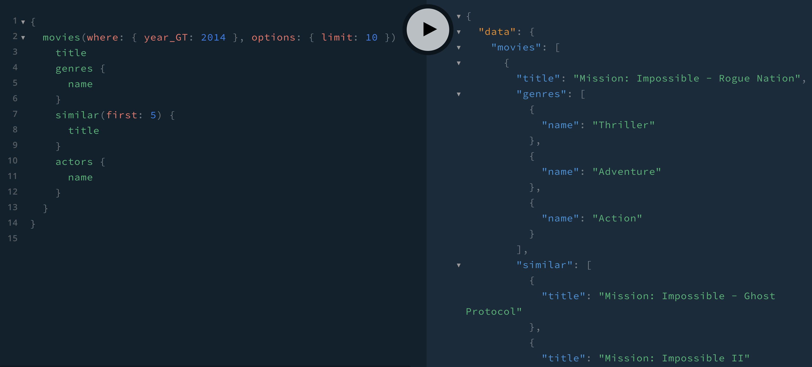

## 🌏  Open in the Cloud 

Click any of the buttons below to start a new development environment to demo or contribute to the codebase without having to install anything on your machine:

[](https://vscode.dev/github/neo4j-graph-examples/template)
[](https://glitch.com/edit/#!/import/github/neo4j-graph-examples/template)
[](https://codespaces.new/neo4j-graph-examples/template)
[](https://codesandbox.io/s/github/neo4j-graph-examples/recommendations/tree/main/graphql?file=/schema.graphql)
[](https://stackblitz.com/github/neo4j-graph-examples/template)
[](https://replit.com/github/neo4j-graph-examples/template)
[](https://app.codeanywhere.com/#https://github.com/neo4j-graph-examples/template)
[](https://gitpod.io/#https://github.com/neo4j-graph-examples/template)

# Recommendations GraphQL API

This directory contains a Node.js GraphQL API application using [`@neo4j/graphql`](https://www.npmjs.com/package/@neo4j/graphql).

Try it live on CodeSandbox [here](https://codesandbox.io/s/github/neo4j-graph-examples/recommendations/tree/main/graphql?file=/schema.graphql)

## Setup

First, edit `.env`, replacing the defaults with your database connection string, user, and database (optional):

```
NEO4J_URI=
NEO4J_USER=
NEO4J_PASSWORD=
NEO4J_DATABASE=
```

The `NEO4J_DATABASE` environment variable is optional and can be omitted. When omitted the default database will be used.

Next, install dependencies.

```
npm install
```

Then start the API application,

```
npm run start
```

This will start a local GraphQL API server at `localhost:4000`.

## Example GraphQL Queries

```GraphQL
{
  movies(where: { year_GT: 2014 }, options: { limit: 10 }) {
    title
    genres {
      name
    }
    similar(first: 5) {
      title
    }
    actors {
      name
    }
  }
}
```


